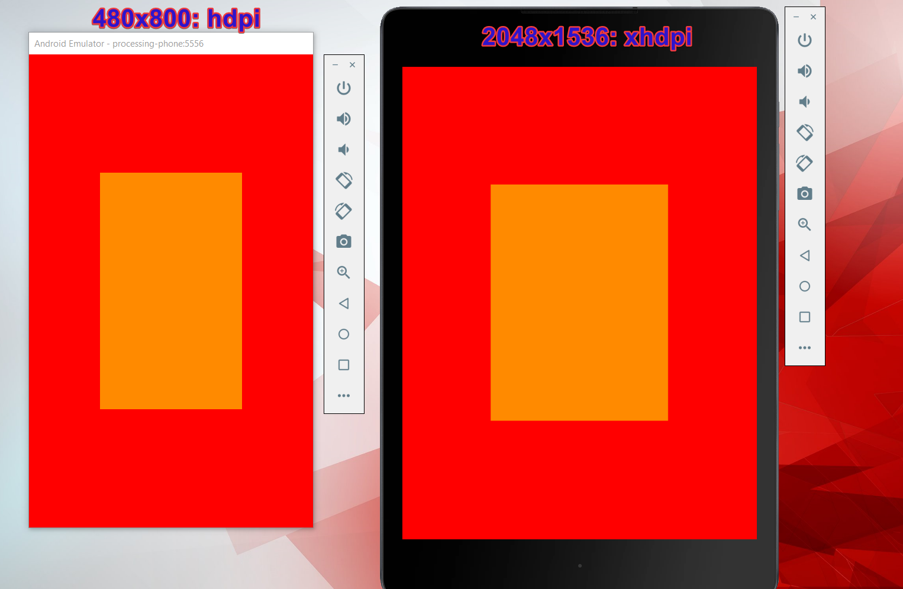
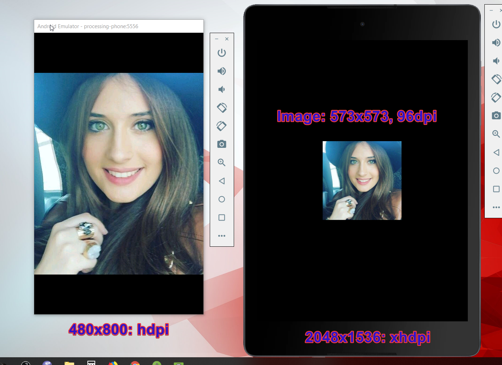

## Master links

---

### Android Comms

* ~~[Android GSoC '19 on Gitter](https://gitter.im/processing-android/GSOC18-general)~~

* [Processing Foundation - GSoC '19 on Slack](https://pf-gsoc.slack.com)

* [GoogleDocs Project Specs(Master)](https://docs.google.com/document/d/1U2xZHCvLO7YeiWTXDE4rCZClWvg4PHYeQuIzgxP_0c0/edit?usp=sharing)
* [GSoC19-AMode-evolution](https://docs.google.com/document/d/1u9IXZOORS4hlYoRrjMZgjfqhDgHXKWgBJr7zo2oWckM/edit)
* [GSoC19 - Email drafts](https://docs.google.com/document/d/1u9IXZOORS4hlYoRrjMZgjfqhDgHXKWgBJr7zo2oWckM/edit)

* [Google Groups Processing GSoC '19](https://groups.google.com/forum/#!forum/the-processing-foundation-google-summer-of-code-2019)

* [GSOC 2019 Email Announcements](https://developers.google.com/open-source/gsoc/2019/mentor-oa-announcements)

### Main Links
* FAQ

* [Maintenance of Android mode: SDK downloader/updater, emulator, library structure - Deeray Esvar R](https://summerofcode.withgoogle.com/dashboard/organization/5693461928345600/proposal/5271234764341248/)
* [Android Mode Structure - Wiki](https://github.com/processing/processing-android/wiki/Android-Mode-Structure/3c8aa38b66b3ff4c88ce058273d19149b856103c)

* [Create an Android library - Android Developers](https://developer.android.com/studio/projects/android-library)

* [Android Processing's main site](https://android.processing.org/tutorials/getting_started/index.html)

* [Build Instructions for Processing Java](https://github.com/processing/processing/wiki/Build-Instructions)

* [Building Processing for Android](https://github.com/processing/processing-android/wiki/Building-Processing-for-Android)

* [Processing's Project List](https://github.com/processing/processing/wiki/Project-List)

* ~~What is TestFlight?~~

* ~~[Firebase test-lab](https://firebase.google.com/docs/test-lab)~~

* ~~[Test apps on Android](https://developer.android.com/training/testing)~~

* ~~Android forums~~

### Kotlin

* [P3 forum: Kotlin Native - Sarah Lensing](https://discourse.processing.org/t/new-idea-swift-playgrounds-mode-for-processing/10021/5)
* [P3 forum: Writing Processing in Kotlin](https://discourse.processing.org/t/writing-processing-in-kotlin/3957)
* [Kotlin Koans (#Learning)](https://kotlinlang.org/docs/tutorials/koans.html)
* [Coursera Kotlin For Java (#Learning)](https://www.coursera.org/learn/kotlin-for-java-developers/home/welcome)
* [Kotlin Tutorial (#Learning)](https://www.youtube.com/watch?v=H_oGi8uuDpA)
* [Kotlin Forum](https://discuss.kotlinlang.org/)

### Support links

* [Markdown cheatsheet](https://github.com/adam-p/markdown-here/wiki/Markdown-Cheatsheet)

* [GitHub Flavored Markdown Spec](https://github.github.com/gfm/)

* [What is Google Summer of Code?](https://google.github.io/gsocguides/mentor/)

* [Undo git commits](https://www.atlassian.com/git/tutorials/undoing-changes)

---

## Demonstration Using Two Emulators (AS)

<h1 align="center">
    
   
</h1>

<h1 align="center">
    
   
</h1>

